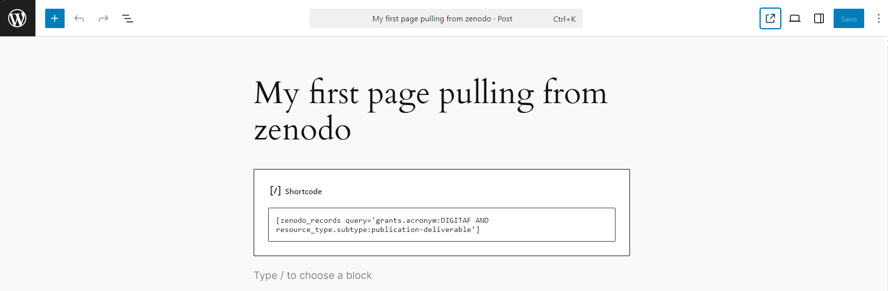
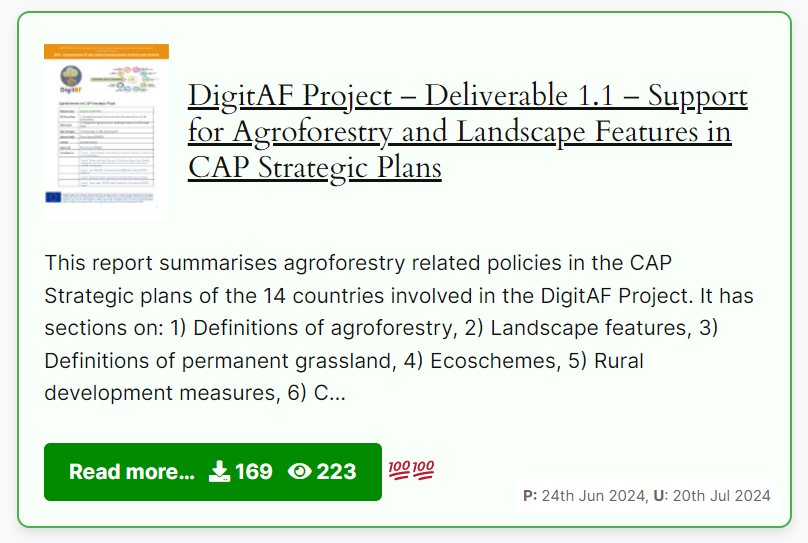

<p align="center"></p>

# A bit of context
 [DigitAF](https://digitaf.eu) is an EU project to help overcome barriers to a widespread implementation of agroforestry practices in Europe. Amongs many tasks, the project embraces the [FAIR principles](https://www.go-fair.org/fair-principles/) with special concerns regarding endured legacy and accessibility of research projects's results. For example all project deliverables are published in [Zenodo](https://zenodo.org) and only after retrieved in the project [website deliverables section](https://digitaf.eu/reports-on-deliverables/) (or you can simply [query directly in Zenodo](https://zenodo.org/search?q=DIGITAF&f=resource_type%3Apublication%2Binner%3Apublication-deliverable)). This ensures that project deliverables will be always available, even if for some reason the project website gets outated or, even closed after a few years. Another "fun" part is that the deliverables section in the website is fed automaticaly once a deliverable is uploaded into Zenodo. \
 \
 Even more interesting is that **this methodology can be applyed for any other project that is willing to promote the [FAIR principles](https://www.go-fair.org/fair-principles/) on their project results**, which actualy is [promoted by the European Comission](https://horizoneuropencpportal.eu/repository/5b7fcc0e-73da-4e76-8b46-3682a36fa59b).
\
\
This plugin was developed to contribute to build up an Agroforestry Virtual Space to engage, seed and re-seed and demonstrate the FAIR principles. In this case, taking advantage of the www.zenodo.org infrastructure to store the legacy of project reports. And at the same time taking usage of the zenodo API to display the zenodo records (with a citable DOI), in the website of a project that was made with Wordpress.
\
We share here an initial code that any website project developer can integrate into ongoing project websites, while promoting the legacy of project results. 
\
\
You will soon learn that you can apply this shortcode to whatever query you are interested to do to the [zenodo](https://zenodo.org) platform.

# wp-shortcode-zenodo 

This little code project creates a plugin in WordPress that enables to retrieve items from [www.zenodo.org](https://www.zenodo.org) with a user-defined query in the shortcode, specific to the needs of each project.
The usage allows to list as cards, e.g. report on deliverables of a project, if, of course, they have been previously published into Zenodo, a great platform that supports the [FAIR principles](https://www.go-fair.org/fair-principles/). 


# How to install

- In your wordpress file manager (there are plenty of free plugins for file managing if you don't have one already) or in your ftp client (e.g. filezilla) navigate to your wordpress installation structure and find the folder folder "wp-content/plugins/" and create a folder called "zenodo-records". 
- Copy the files: 1) zenodo-records.php 2) style.css and 3) pdf-file.png into that folder. Your folder structure should look like this: \
>wp-content/plugins/ 
>> zenodo-records
>>> zenodo-records.php \
>>> style.css \
>>> pdf-file.png

- At this stage, when you access worpress backend dashboard and select plugins, you will be able to see the "Zenodo Records Shortcode" plugin on your plugins list. You now need to click on **Activate** just below the plugin name. And then it should be ready to use.
  
## Usage

There are plenty articles [showing how to use shortcodes](https://wordpress.com/support/wordpress-editor/blocks/shortcode-block/) which is out of scope of this readme file, so read a few articles (the link just above should be enough) if you aren't familiar with the use of shortcodes.  But here is a screenshot of the usage of a shortcode in a post article:
<p align="center"></p>

To list items from zenodo that are deliverables from the project, e.g. "DIGITAF", you can use the following shortcode:
```
[zenodo_records query='grants.acronym:DIGITAF AND resource_type.subtype:publication-deliverable']
```
<span style="background-color: green">[UPDATE July 2025]</span> - you can now add arguments to control the colors:
```
[zenodo_records query='grants.acronym:DIGITAF AND resource_type.subtype:publication-deliverable' border_color='#4CAF50' background='#f9fff9' button_color='#008b00']
```
you can use this shortcode to retrieve exactly the same results:
```
[zenodo_records query='grants.code:101059794 AND resource_type.subtype:publication-deliverable']
```
or retreive from another (Agroforestry) project that has used zenodo to store outputs. For example this shortcode will list reports from the [AGFORWARD](https://www.agforward.eu) project:
```
[zenodo_records query='grants.code:613520 AND resource_type.type:publication']
```

or any other project! &#x1F60A; ... just replace your grant code... 

if you need to go more in depth exploring other options in the query, jut go to the [zenodo API developer](https://developers.zenodo.org/?shell#list36). 

Remember: to have results pulling documents from zenodo, they first need to be published in Zenodo! &#x1F60A; 

# Result
The shortcode will create one card for each record yielded from the query like this:
<p align="center"></p>
creating a thumbnail of the PDF, title, a intro of the description, how many downloads and how many views, with the &#128175; tag for each 100 views, when was published (P) and when was updated (U) with a new version.

## What it does on the back-end

In practice, what this plugin does is to access the zenodo API, sending the query and collect the JSON result and format the display. The format uses the style.css which is a bit driven toward the DigitAF project visual identity, but this can be edited according to your needs, e.g. to match the style of your own website. 

here is a live example of shuch shortcode in action:
https://digitaf.eu/reports-on-deliverables/

which is listing the same results as in zenodo:
https://zenodo.org/search?q=grants.acronym%3ADIGITAF%20AND%20resource_type.subtype%3Apublication-deliverable

but with a different style &#x1F60A;


## Styling
- <span style="background-color: green">[UPDATE July 2025]</span>. You can now minimize the edit od the CSS. You can now control the 1) Border color, 2) The card background color, 3) the button color. See the [examples below](#examples)
- Edit the style.css to your needs (Comments were added to ease the job). It is suggested to create a copy of the file and name it "style_original.css" and edit the style.css to your needs (e.g. to match the design of your website). If you want to create your own css filen name, e.g. myownstyle.css, make sure to replace the following piece of code in the ```zenodo-records.php``` file:
 
```php
wp_enqueue_style('zenodo-records-style', plugins_url('style.css', __FILE__));
```
with this
```php
wp_enqueue_style('zenodo-records-style', plugins_url('myownstyle.css', __FILE__));
```
The classes of the CSS file target the html elements generated by the the function
```php
function zenodo_records_shortcode($atts)
```
Feel free to change and send us your examples. We will be glad to hear you are engaging with the FAIR principles.

# [Examples](#examples)
- Project deliverables of the project DigitAF: https://digitaf.eu/reports-on-deliverables/ using the shorcode:

[zenodo_records query='grants.acronym:DIGITAF AND resource_type.subtype:publication-deliverable' <span style="background-color: green"> border_color='#4CAF50' background='#f9fff9' button_color='#008b00'</span>]

- Agroforestry policy briefings published by EURAF during the DigitAF project: https://digitaf.eu/policy-briefings/ using the shortcode:

[zenodo_records query='grants.acronym:DIGITAF AND resource_type.subtype:publication-workingpaper' <span style="background-color: green">border_color='#4CAF50' background='#f9fff9' button_color='#008b00'</span>]

**Note:** <span style="background-color: green">[UPDATE July 2025]</span> You can now control the colors of the cards in the shorcode. No need to edit the CSS, unless you want to change the card apperance dramatically. You can use HEX (e.g. '#FFFFFF') or Color Names (e.g. 'black')